# STEP 2: Create your Autonomous database

## Objectives
- Create your first ATP instance
- Create your ALWAYS FREE autonomous database instance

## Create your first ATP instance
- Open www.oracle.com and click on the icon in red square.

- You should see "Sign in to Cloud" link

- Enter your cloud account name, which you have previously provided during you account creation, for example "mycloudtenancy". Usually you should have received a welcome email with the subject "Get Started Now With Oracle Cloud" and all the login instruction.

- Enter your login credentials, such as admin user account with password.

 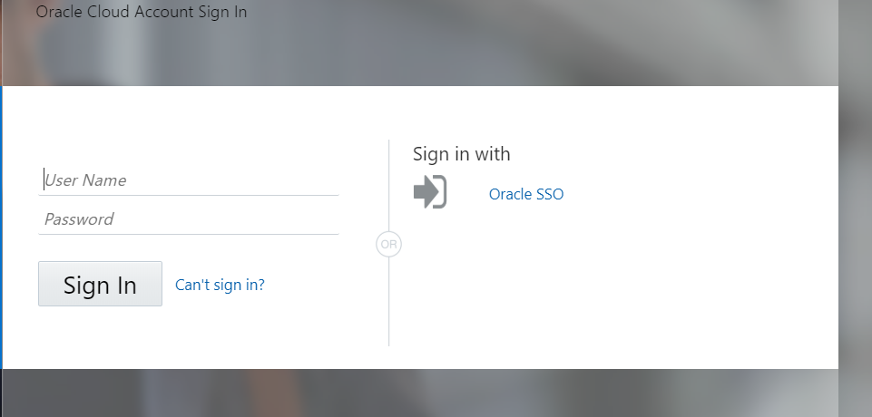

- On the left hand menu, choose Autonomous Transaction Processing.

  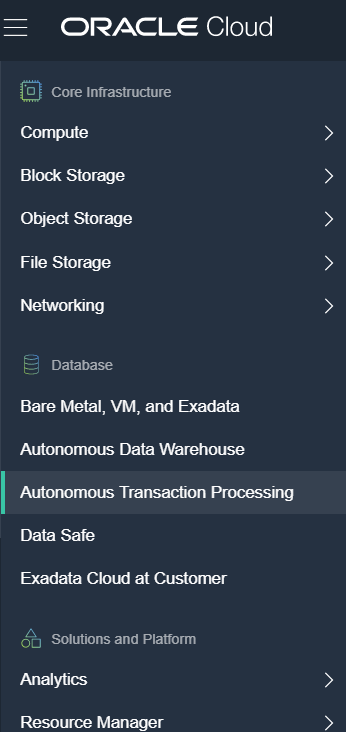

- Click on **Create Autonomous Database**

  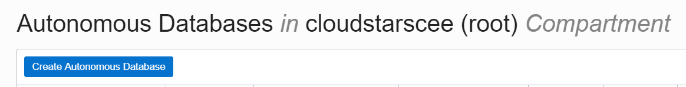
  
- Enter **Display name** and **Database name** to  the database, in this case "Warrior".

  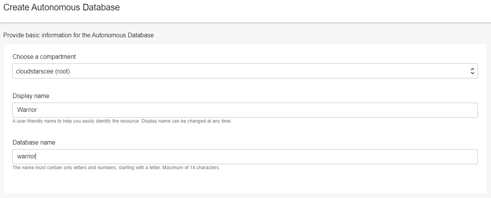
  
- Please choose the **Transaction Processing**, which is optimized the database for daily transactional processing, just like OLTP database.
- For your demo purpose, please also make sure you choose **"Serverless"**.

  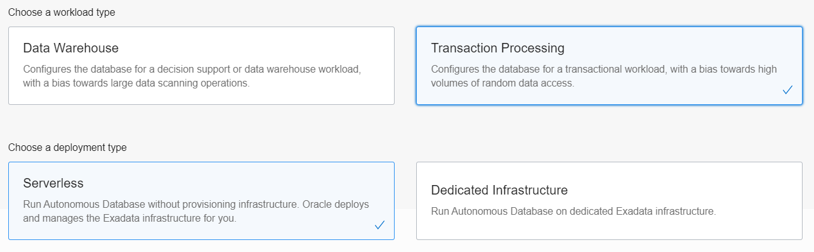
  
- Choose OCPU count **1** and storage size **1TB** for this lab.
  
  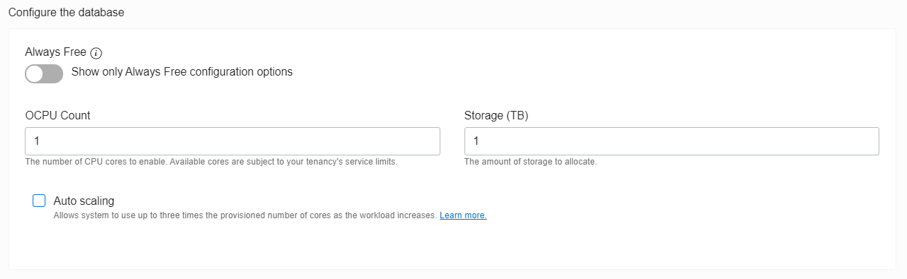
  
- For experienced users, who have been using Oracle Database 18c for some period, you can choose to enable **19c** in your Autonomous database, but we will skip and don't choose for this lab.

  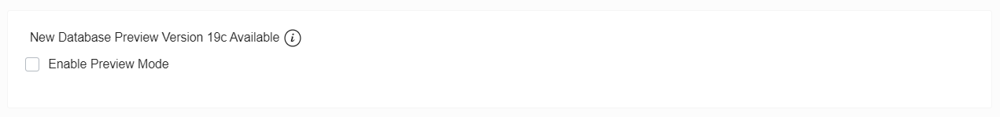
  
- Provide your database credential for **"ADMIN"** user schema.

  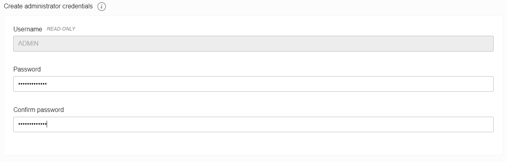

- Choose **BYOL** option

  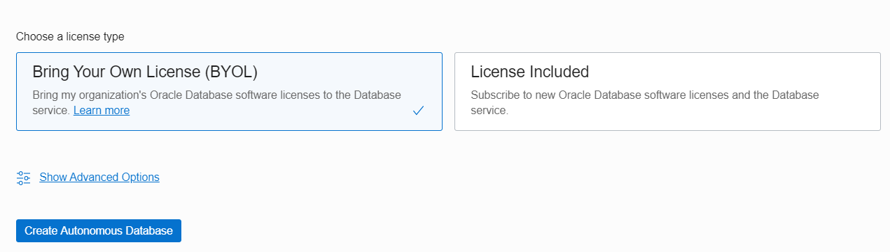
  
- Provisioning your autonomous database will take usually 3-5 minutes, after that you will be able to experience the power of autonomous. 
## Create your **ALWAYS FREE** autonomous database instance

- You need to follow same steps as previous, however, in order to have your **ALWAYS FREE** autonomous database, by clicking on radio button as shown in below 

  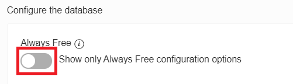
  
- Once you click on radio button **ALWAYS FREE**, compute power and storage will be limited by default, you cannot edit the values.

  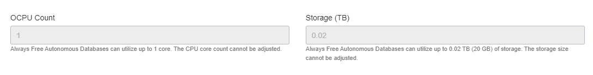

- **License Included** option will automatically enabled when you choose to enable **ALWAYS FREE**.

  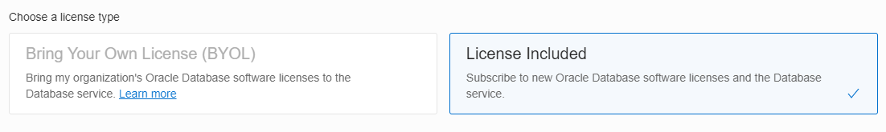

- Here is the short video of steps provisioning my ATP instance:

  

Now you have two autonomous databases, **Autonomous Transaction Processing** and **ALWAYS FREE ATP**.
	
# Follow-up questions

[bilegt.bat.ochir@oracle.com](mailto:bilegt.bat.ochir@oracle.com)
