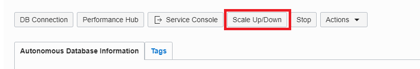
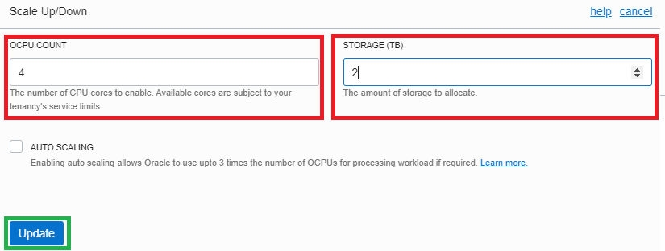
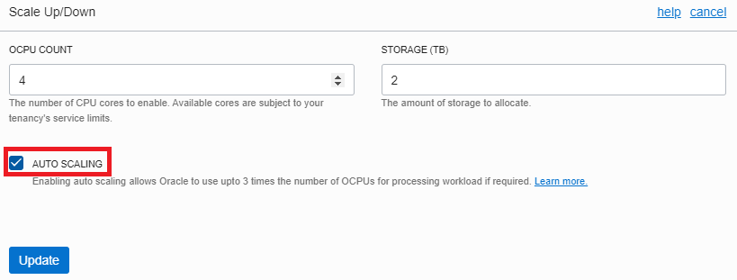
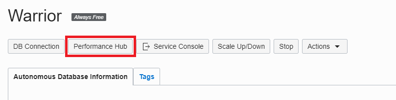
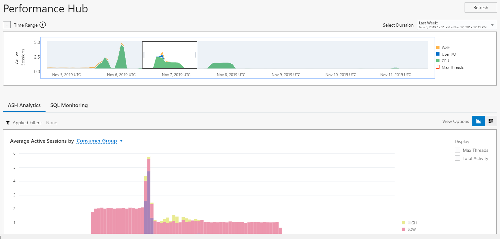

- [Go back to main](/README.md)
- [Go back to previous step](/step2.md)

# STEP 3: Explore Autonomous Database console #
## Objectives

- Scale up/down your ATP
- Configure auto-scaling
- Accessing to performance hub

## Scale up and down your ATP

- Open you ATP instance and you can scale up, down your compute power, storage size by clicking on Scale Up/Down.

	

- Enter 4 OCPU in compute and 2TB in storage values
  
	
	
## Configure auto-Scaling in your ATP

Auto-scaling is a very powerful feature that lets our application handle peaks of traffic, while keeping costs under control at the same time. We will define a minimum number of OCPUs that our ATP will provision and the database will automatically scale up to three times that number, in case the demand arrives.

- Click on Scale Up/Down.

	

- Activate the AUTO SCALING checkbox: once you turn this on, the database will use up to three times the number of original cores to 
  execute its workloads. 
  
	

## Accesing the Performance Hub
The Performance Hub is a great tool to monitor our ATP status and activity. It is accessible from the Service Console.

- Open the Autonomous Database Details page and click on Performance Hub.
	

- In the upper part we will see the consumption of resources and waits of our sessions along time. In the lower part, we will be able to check the ASH (Active Session History) analysis, access the SQL Monitoring to analyze individual queries or even submit a session kill command.
	

You may continue to next step 
- [APEX on Autonomous Database](step4.md)

## Follow-up questions

[bilegt.bat.ochir@oracle.com](mailto:bilegt.bat.ochir@oracle.com)
