- [Go back to main](/README.md)
- [Go back to previous step](/step4.md)

# Step 4: Create your first application in APEX
## Objectives
- Explore the bundled features of Autonomous database.
- Become familiar with APEX.
- Create a machine learning model to identify customers that are likely to buy a certain product.

## Import application to your existing APEX workspace

Our starting point is an existing CRM application used by a fictional company. This contains basic information about our company's customers. The application is used by the sales/service employees of our company to look up details whenever a customer calls them.
First download the application that we will install. You can find it [here](./files/f100.sql). Download and save it as f100.sql. 

- Go to your ATP database and open the Service Console.

  
  
- Go to Development and open APEX.
  
  
  
- Provide your password when you created "WORKSHOPATP" user in previous step.

  
  
- Once you are in, click on **App Builder**

  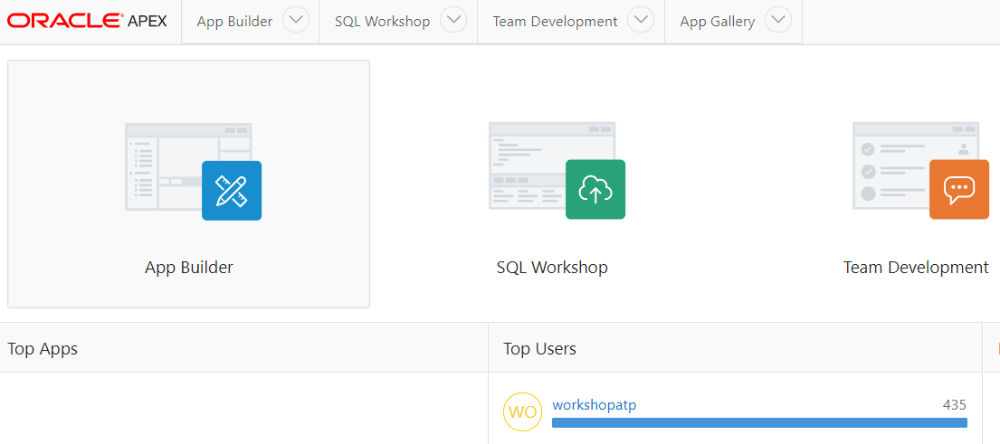
  
- Then choose **Import** 

  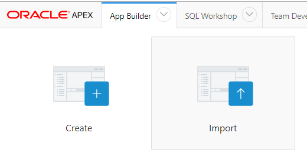
  
- Select the file that you downloaded earlier, then "Next"

  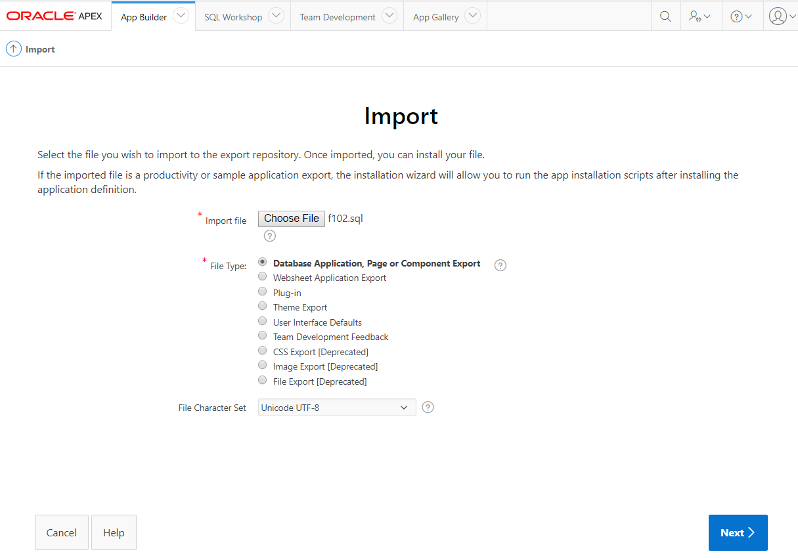
  
- Review the configuration parameters, then "Install Application"

  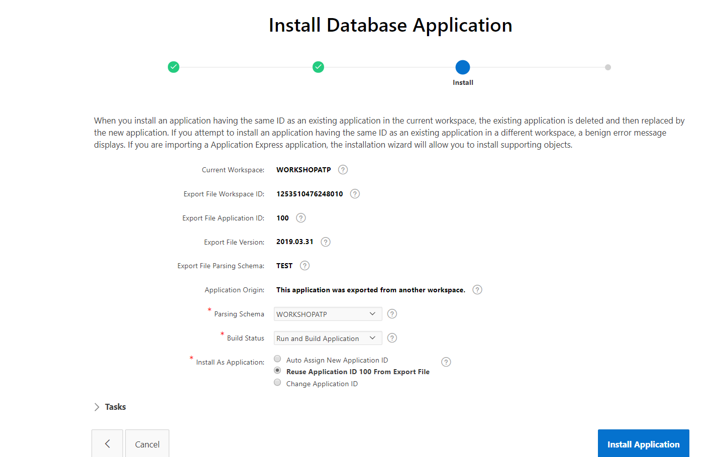

- You will be asked also to review the installation of supporting database objects, who are going to be used part of this application.

  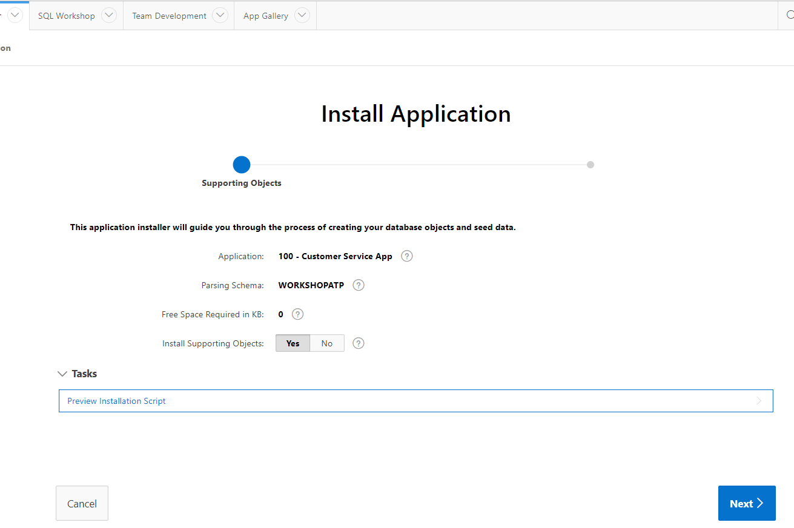
  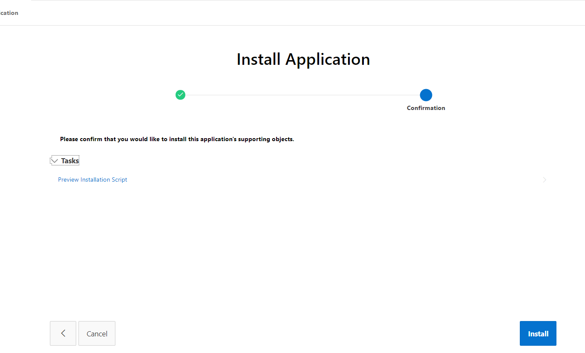

- After successful installation, you will see a summary page without any warnings or errors. Click on **Run Application**

  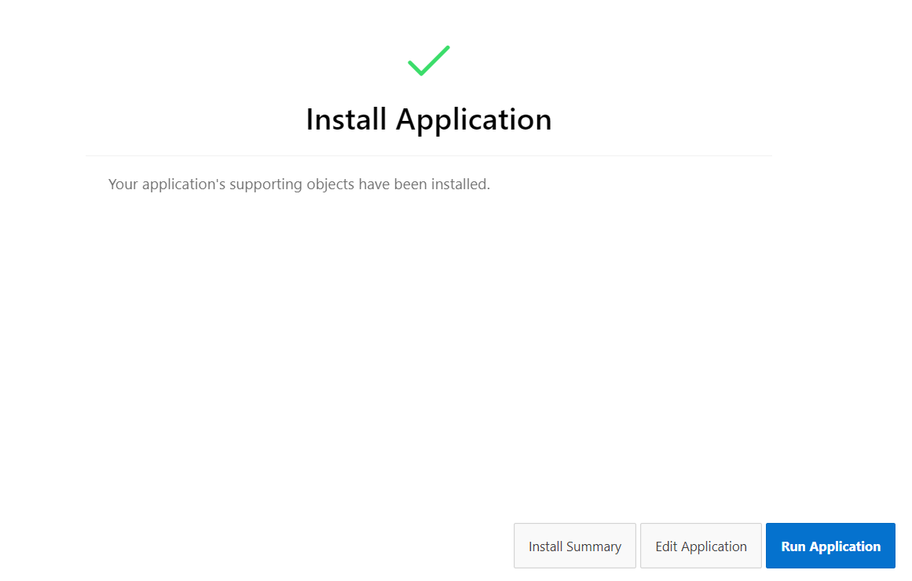

- Provide your "WORKSHOPATP" username and password to login.

  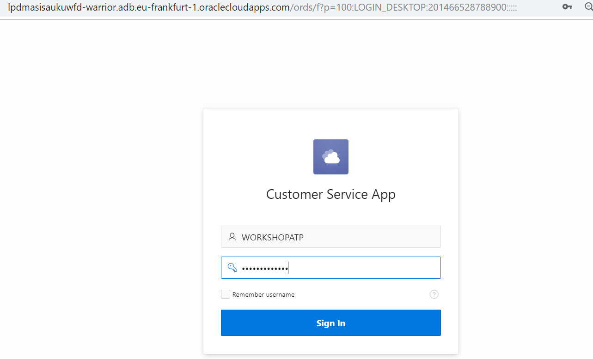
  
- Here you are seeing our fictional company's current CRM application, which are running on Autonomous database. 

  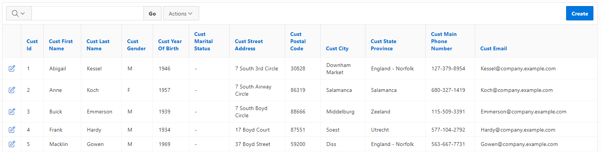

- I'd like you to browse existing data by clicking on arrow in on a row, and create a new customer by clicking on "Create" button. It's fully functional.

  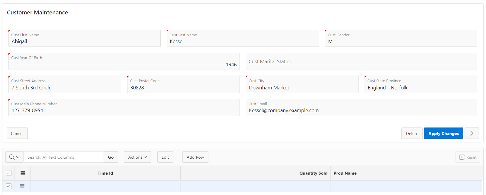

- If you go back to the newly created application, you can see how many pages are created in order to run this APEX application.

  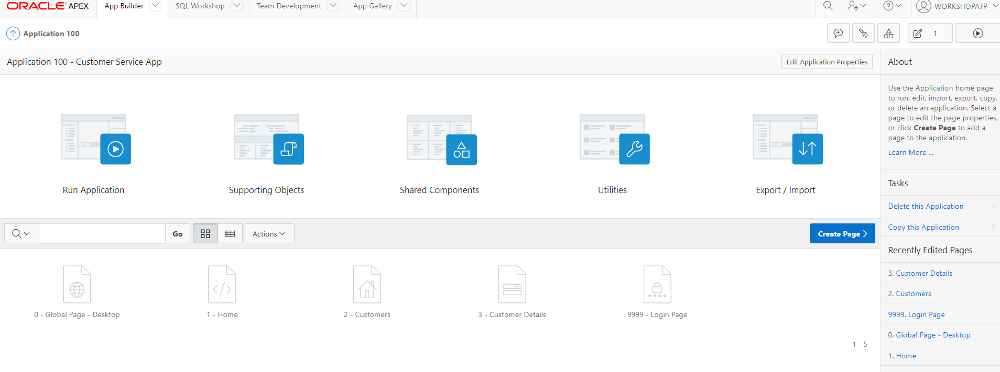
  
## Here is the short summary video of above steps:

## You may continue to next step 
- [REST in APEX](step6.md)

## Follow-up questions

[bilegt.bat.ochir@oracle.com](mailto:bilegt.bat.ochir@oracle.com)
