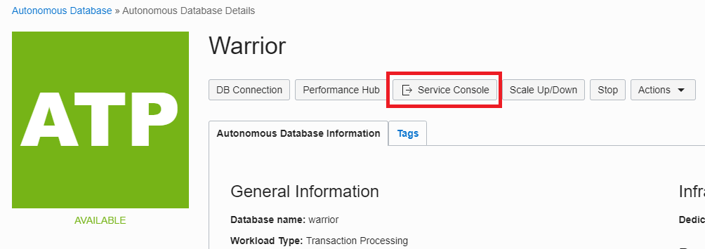
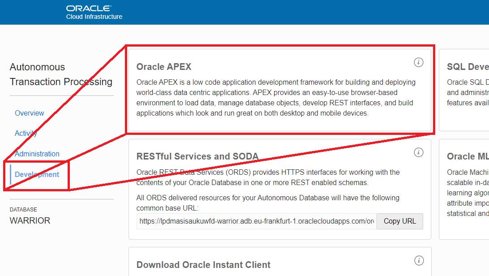
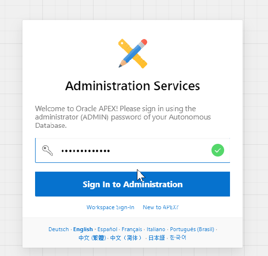
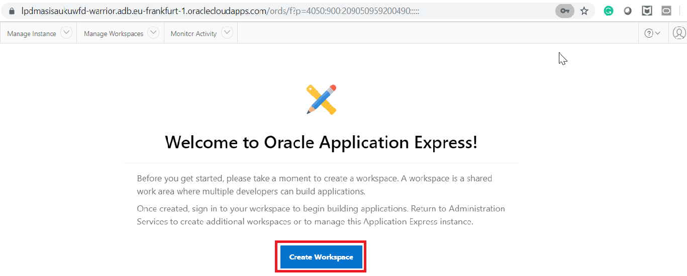
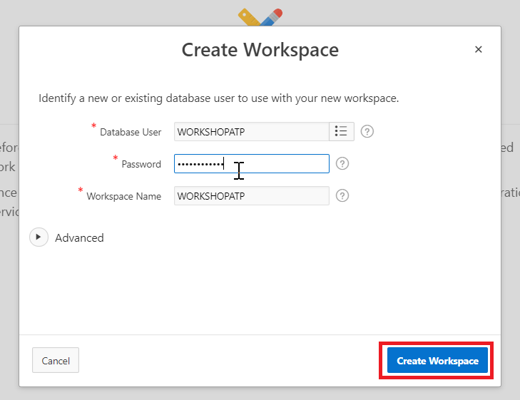
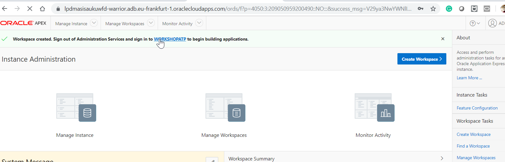
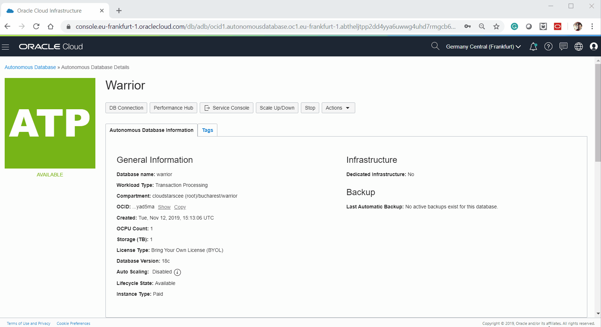

- [Go back to main](/README.md)
- [Go back to previous step](/step4.md)

# Step 4: Create your first application in APEX
## Objectives
- Configure your APEX workspace

## Configure the APEX workspace

- Go to your ATP database and open the Service Console.

  
  
- Go to Development and open APEX.
  
  
  
-  You will see the login page fof APEX Administration Services. Use the ADMIN password that you entered when you provision ATP.

  

- Click on **Create workspace** to configure your APEX playground.
  
  

- You can create a workspace and a database user at sametime. Let's create new user "WORKSHOPATP" and "WORKSHOPATP" workspace will be created accordingly.     *Keep a note of the password as you will need it later.*

  
  
- New workspace and database user is created. Now click on hyperlink "WORKSHOPATP".

  
  
- Provide your password when you created "WORKSHOPATP" user in previous step.

  

## Here is the short summary video of above steps:

  

## You may continue to next step 
- [Create your first application in APEX](step5.md)

## Follow-up questions

[bilegt.bat.ochir@oracle.com](mailto:bilegt.bat.ochir@oracle.com)
