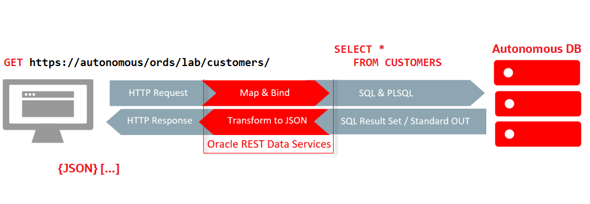
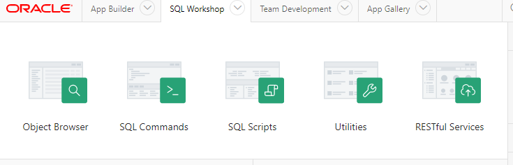
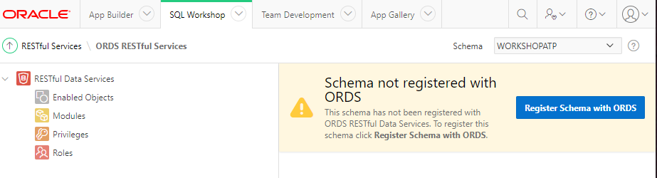
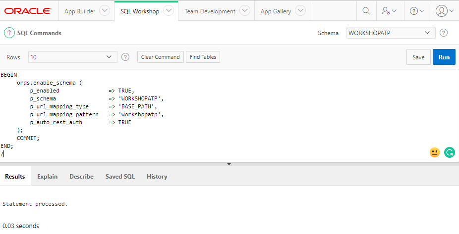
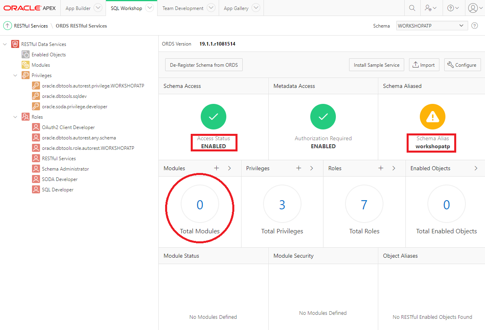
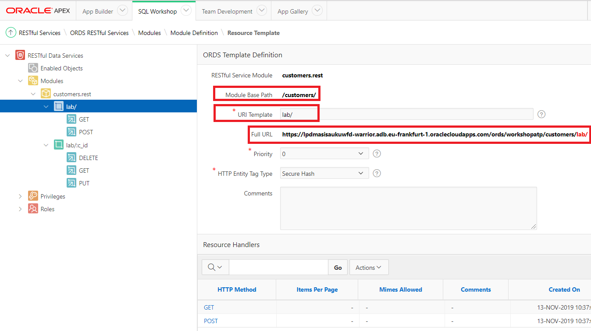
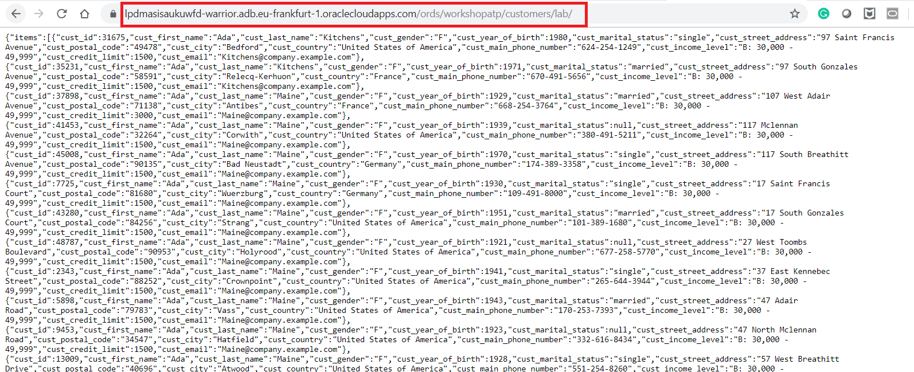
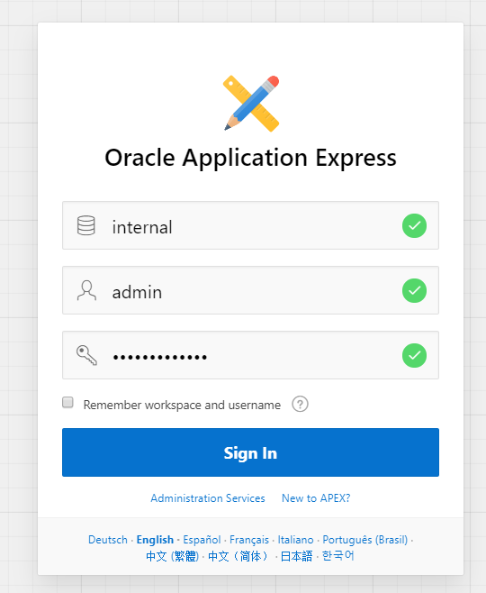
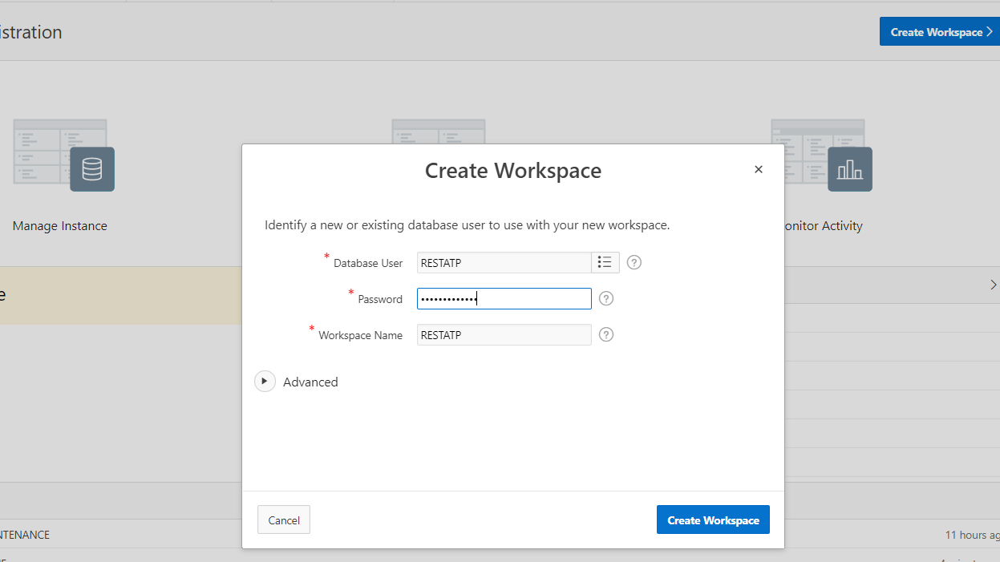
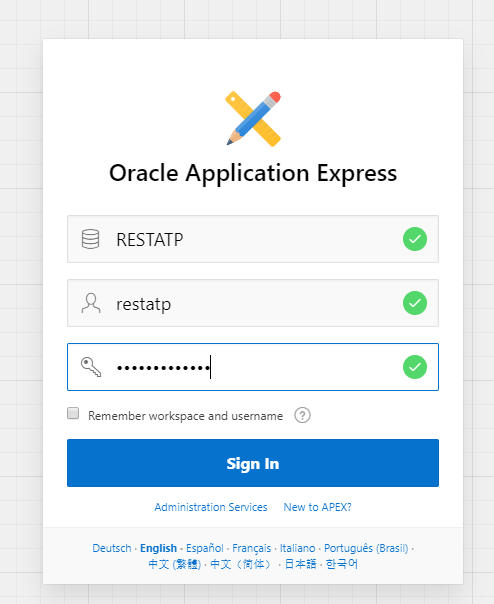

- [Go back to main](/README.md)
- [Go back to previous step](/step5.md)

# Step 6: REST in APEX
## Objectives
- Define RESTful services in Autonomous database.
- Create an app in a second workspace RESTATP.
- Utilize RESTful service using GET,POST,PUT,DELETE methods from the second workspace RESTATP.

What is REST(Representational State Transfer), It's an architecture that provides interoperability between two computer systems using HTTP(s) protocol as a transport protocol.
Content usually represented via **JSON** or **XML** and great thing about REST is the two participants in the communication can be completely different in terms of:
  - Language (JAVA,.NET, PHP, etc.)
  - Database (Oracle, Microsoft, MongoDB, Hadoop, Couchbase, etc.)
  - Architecture (On Premises, Cloud, Mixed)
  
 

We will learn just how easy it is to build Oracle APEX apps utilizing RESTful Services.

## Define RESTful services in Autonomous database.

In this part we will enable REST services in WORKSHOPATP instance.
- Go to your APEX workspace

  
  
- Open SQL Workshop, this is built-in, web edition of Oracle SQL developer, and can fulfill the most of your needs. Go to RESTful services tab.

  
  
- As you can see, currently there is no schema is enabled for REST.
  
- Go to SQL commands tab and run following code. 

```
BEGIN
     ords.enable_schema (
         p_enabled               => TRUE,
         p_schema                => 'WORKSHOPATP',
         p_url_mapping_type      => 'BASE_PATH',
         p_url_mapping_pattern   => 'workshopatp',
         p_auto_rest_auth        => TRUE
     );
     COMMIT;
END;
```
  
  Result as below:
  
  

- Go back to RESTful services tab, now you can see the differences. We have enabled REST services in **WORKSHOPATP** schema. But there is no object is accessible.

  

- Go to SQL Commands tab and run following code. 

```
begin
    ords.delete_module(
        p_module_name => 'customers.rest' );
    ords.define_module(
        p_module_name => 'customers.rest',
        p_base_path => '/customers/' );
    ords.define_template(
        p_module_name => 'customers.rest',
        p_pattern     => 'lab/' );
    ords.define_template(
        p_module_name => 'customers.rest',
        p_pattern     => 'lab/:c_id' );
    ords.define_handler(
        p_module_name => 'customers.rest',
        p_pattern     => 'lab/',
        p_method      => 'GET',
        p_source_type => ords.source_type_collection_feed,
        p_source      => 'select * from customers' );
    ords.define_handler(
        p_module_name => 'customers.rest',
        p_pattern     => 'lab/:c_id',
        p_method      => 'GET',
        p_source_type => ords.source_type_collection_item,
        p_source      => 'select * from customers where cust_id = :c_id' );
    ords.define_handler(
        p_module_name => 'customers.rest',
        p_pattern     => 'lab/',
        p_method      => 'POST',
        p_source_type => ords.source_type_plsql,
        p_source      => 'begin insert into customers (CUST_FIRST_NAME,CUST_LAST_NAME,CUST_GENDER,CUST_YEAR_OF_BIRTH,CUST_MARITAL_STATUS,CUST_STREET_ADDRESS,CUST_POSTAL_CODE,CUST_CITY,CUST_COUNTRY,CUST_MAIN_PHONE_NUMBER,CUST_INCOME_LEVEL,CUST_CREDIT_LIMIT,CUST_EMAIL) values (:c_fname,:c_lname,:c_gender,:c_yob,:c_marital,:c_address,:c_postal,:c_city,:c_country,:c_phone,:c_income,:c_credit,:c_email);:forward_location:=:c_id;:status_code:=201;end;' );
    ords.define_handler(
        p_module_name => 'customers.rest',
        p_pattern     => 'lab/:c_id',
        p_method      => 'PUT',
        p_source_type => ords.source_type_plsql,
        p_source      => 'begin update customers set CUST_FIRST_NAME=:c_fname,CUST_LAST_NAME=:c_lname,CUST_GENDER=:c_gender,CUST_YEAR_OF_BIRTH=:c_yob,CUST_MARITAL_STATUS=:c_marital,CUST_STREET_ADDRESS=:c_address,CUST_POSTAL_CODE=:c_postal,CUST_CITY=:c_city,CUST_COUNTRY=:c_country,CUST_MAIN_PHONE_NUMBER=:c_phone,CUST_INCOME_LEVEL=:c_income,CUST_CREDIT_LIMIT=:c_credit,CUST_EMAIL=:c_email where cust_id=:c_id; :forward_location:=:c_id;:status_code:=200;end;' );
    ords.define_handler(
        p_module_name => 'customers.rest',
        p_pattern     => 'lab/:c_id',
        p_method      => 'DELETE',
        p_source_type => ords.source_type_plsql,
        p_source      => 'begin delete customers where cust_id=:c_id;:status_code:=200;end;' );
    COMMIT;
end;/
```
- You have just created the base path "CUSTOMERS", that will be used to access this RESTful service and the URI Template "LAB" that will be used to access the specific resource. The URI Template for the resource is appended to the server path and module base path.



- If you copy the full URL and paste in the browser, you will get JSON dataset.



## Create an app in a second workspace RESTATP.

-  You will follow same steps as we did in [step 4](step4.md). Logout from your current APEX workspace, and login as **ADMIN**

  

- Click on **Create workspace** to configure your second APEX workspace. Let's name it **RESTATP** and remember *keep note of the password as you will need it later.*
  
  
  
- New workspace and database user is created. Now click on hyperlink "RESTATP".

  
  
- Provide your password when you created "RESTATP" user in previous step.

  
  
## Utilize RESTful service


## Here is the short summary video of above steps:


## You may continue to next step 
- [REST in APEX](README.md)

## Follow-up questions


[bilegt.bat.ochir@oracle.com](mailto:bilegt.bat.ochir@oracle.com)
