- [Go back to main](/README.md)
- [Go back to previous step](/step6.md)

# Step 6: REST in APEX
## Objectives
- Create your second workspace with an empty application
- Utilize RESTful service using GET,POST,PUT,DELETE methods from the second workspace RESTATP.

## Create your second workspace with an empty application.

-  You will follow same steps as we did in [step 4](step4.md). Logout from your current APEX workspace, and login as **ADMIN** user. When you are logging as **ADMIN** user, name of the workspace is **INTERNAL** and password is your database password which you have provided in ATP instance provisioning.

  

- Click on **Create workspace** to configure your second APEX workspace. Let's name it **RESTATP** and remember *keep note of the password as you will need it later.*
  
  
  
- New workspace and database user is created. Now click on hyperlink "RESTATP".

  
  
- Provide your password when you created "RESTATP" user in previous step.

  

- Go to App Builder and click on **Create Application**, then choose New Application from the options. 
- We will create an empty application, therefore just provide the name then click **Create Application**.

  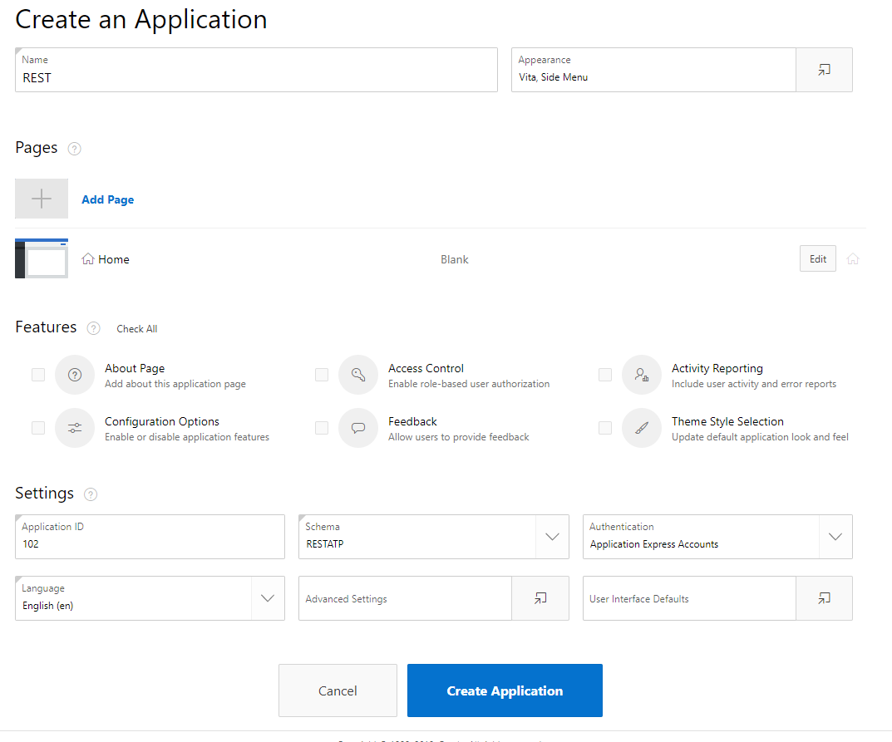

- Explore your new application.

## Configure RESTful web source.
- Now we will create our RESTful web source in our newly created application. Go to your application then open **Shared Components**.

  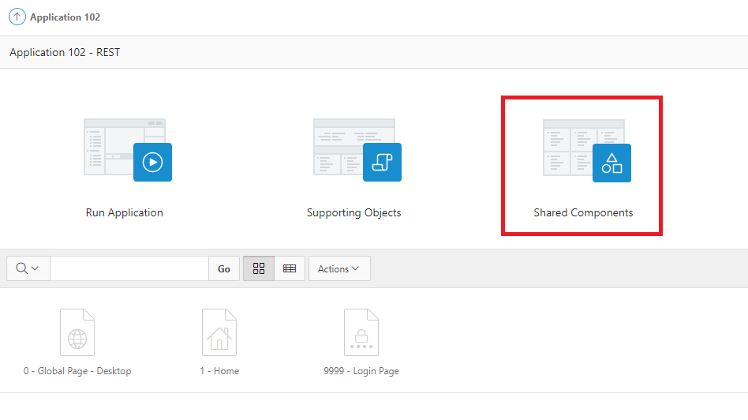  
  
- Find **Web Source Modules** from Data Sources section.

  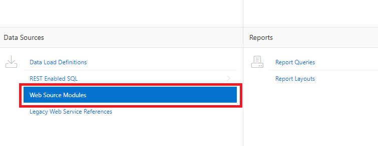  
  

- Find **Web Source Modules** from Data Sources section.

  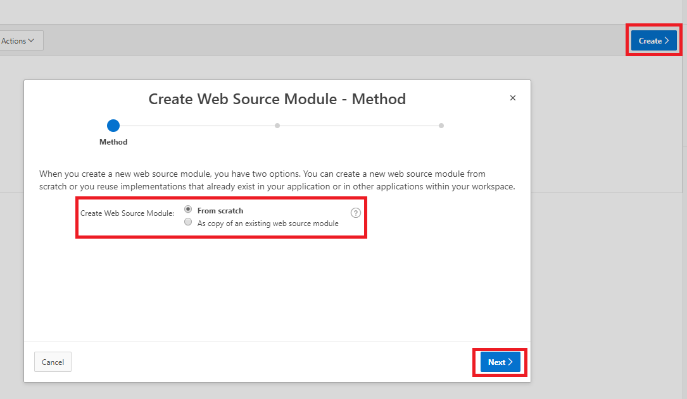  
  

- Find **Web Source Modules** from Data Sources section.

  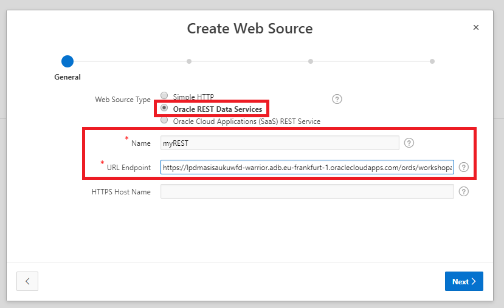  
  

- Find **Web Source Modules** from Data Sources section.

  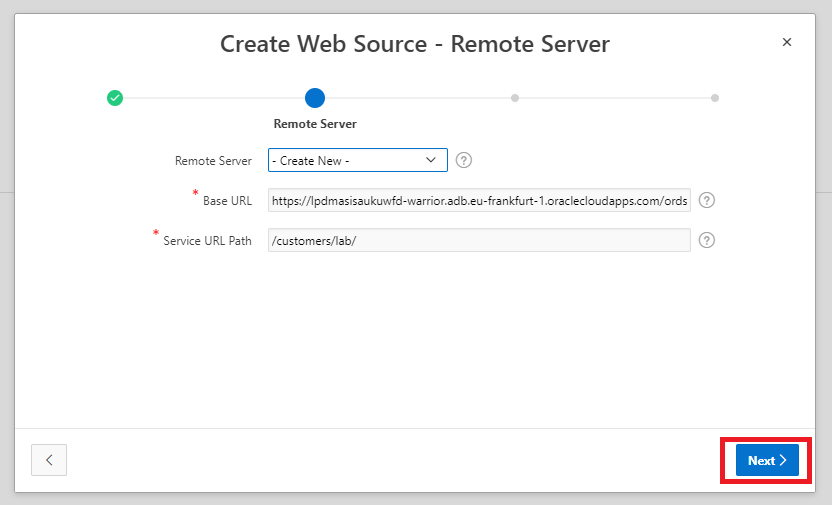  
  

- Find **Web Source Modules** from Data Sources section.

  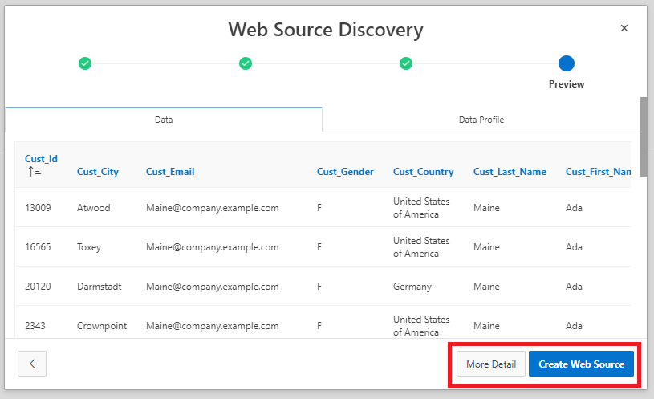  
  

- Find **Web Source Modules** from Data Sources section.

  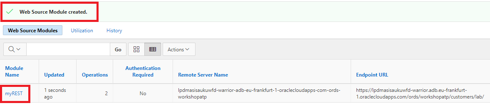  
  

- Find **Web Source Modules** from Data Sources section.

  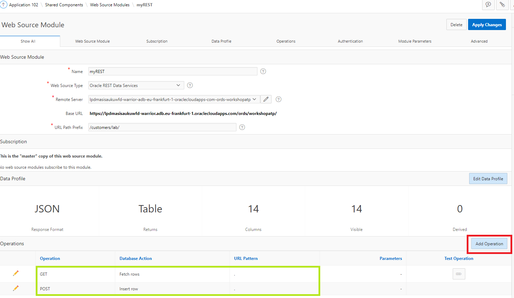  
  

- Find **Web Source Modules** from Data Sources section.

  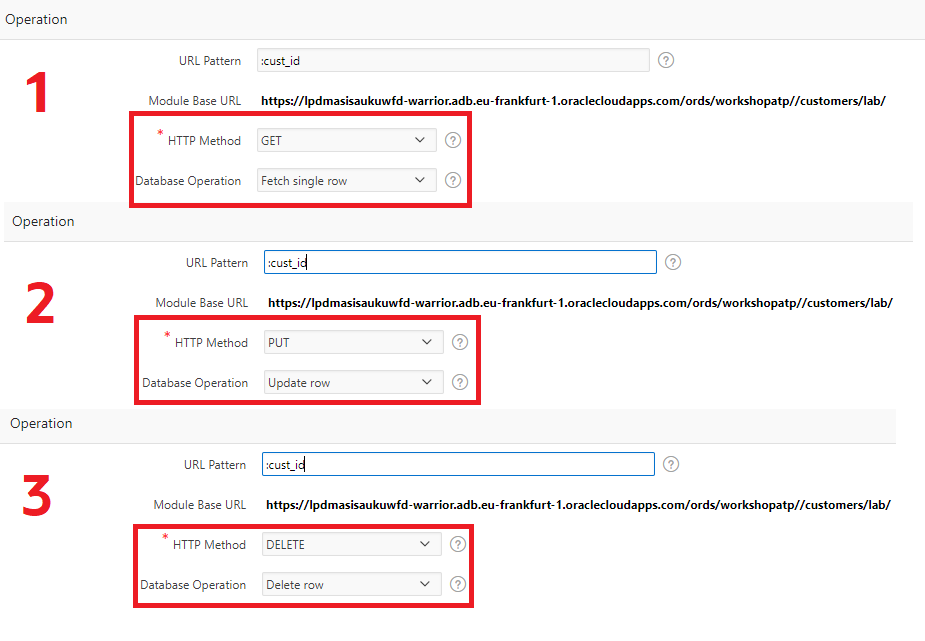  

- Find **Web Source Modules** from Data Sources section.

  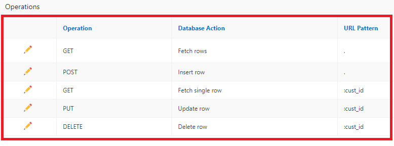  

- Find **Web Source Modules** from Data Sources section.

  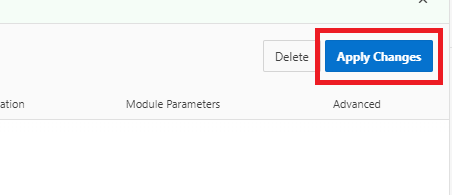  

- Find **Web Source Modules** from Data Sources section.

  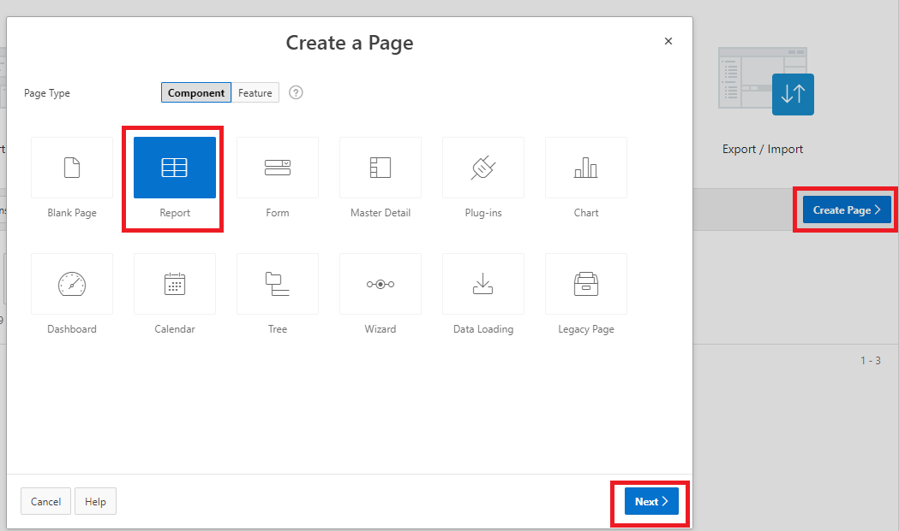  

- Find **Web Source Modules** from Data Sources section.

  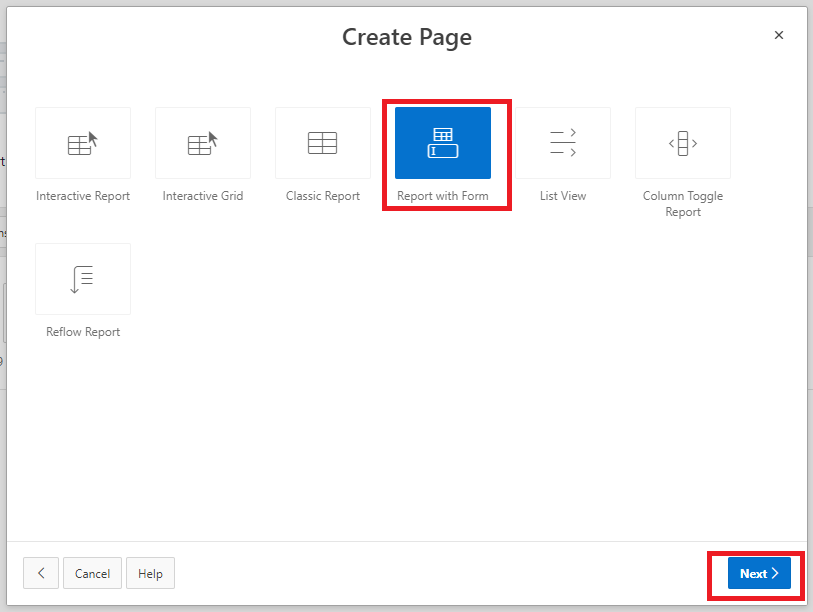  

- Find **Web Source Modules** from Data Sources section.

  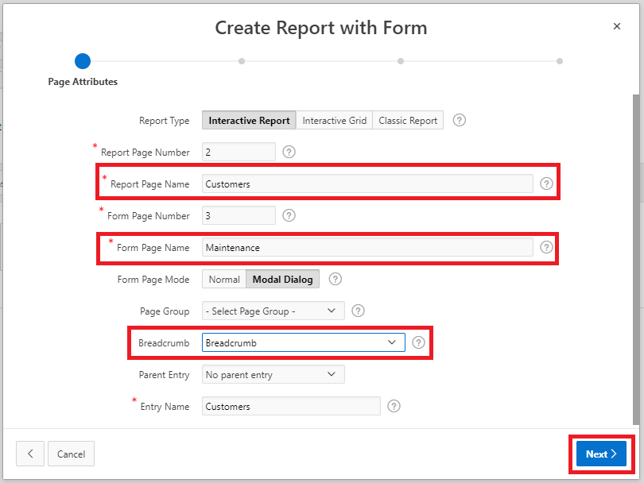  

- Find **Web Source Modules** from Data Sources section.

  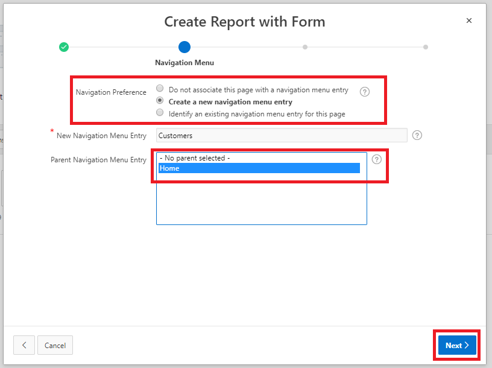  

- Find **Web Source Modules** from Data Sources section.

  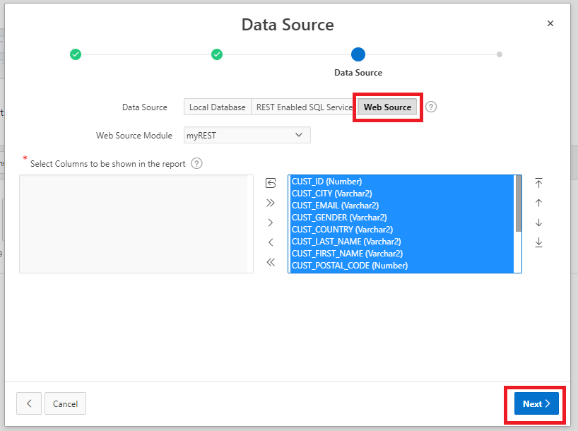  

- Find **Web Source Modules** from Data Sources section.

  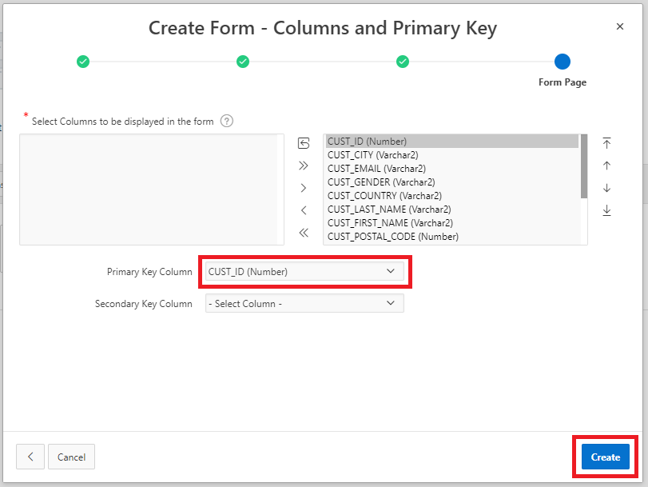  

- Find **Web Source Modules** from Data Sources section.

  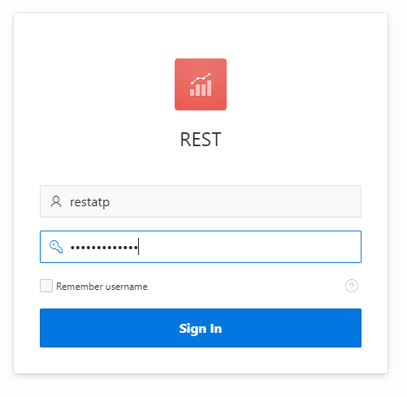  

- Find **Web Source Modules** from Data Sources section.

  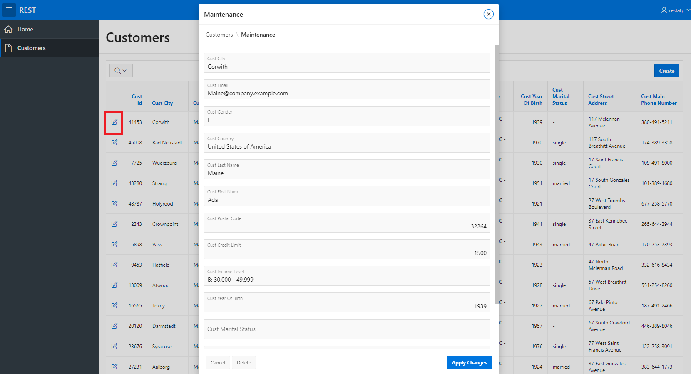  

## You may continue to next step 
- [Next step is not ready](README.md)

## Follow-up questions

[bilegt.bat.ochir@oracle.com](mailto:bilegt.bat.ochir@oracle.com)
