- [Go back to main](/README.md)
- [Go back to previous step](/step6.md)

# Step 8: Explore Machine Learning
## Objectives
- Create Machine Learning user
- Explore Machine Learning console.
- Become familiar with machine learning algorithms.
- Identify customers who are likely to buy some product based on machine learning prediction.

## Continue from Step 5.

-  Once you have successfully completed [step5](/step5.md) we will continue from here.

Our goal is to upsell something to our customers. We want to alert our employee whenever he/she has a customer on the screen that is a good candidate for a particular product that we're trying to sell. In practice this means that we want to add a column on this screen that shows whether it's a good idea to try to upsell to this customer. This will be the topic for the rest of the exercise.

We will develop the machine learning model using Zeppelin, which comes included in the autonomous database. Zeppelin is a web-based notebook environment that allows us to analyse and experiment with data. In our case we will be using it to build a machine learning model. First we will set up a user for Zeppelin.

- Open Autonomous database console and go to **Tools** tab, then click on Oracle ML User Administration 
  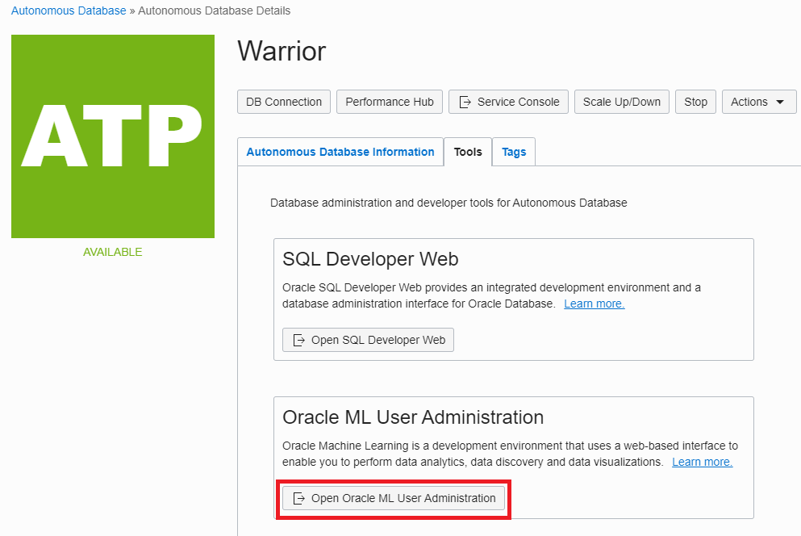
  
- Provide your ADMIN user password

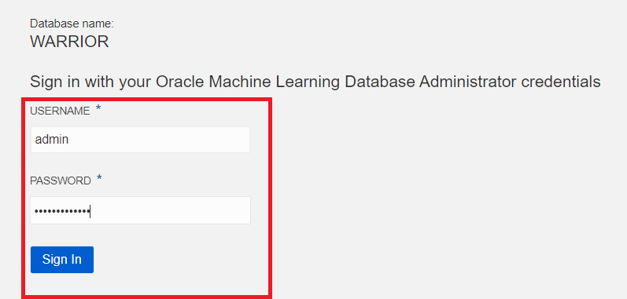

- Create a user called **MACHINEUSER** and provide your password by unticking the box

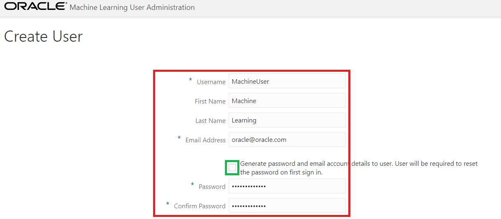

- Once you have created your Machine learning user, go back to Autonomous database **Service Console** and go to **Development** tab, then open **Oracle ML SQL Notebooks**. Sign in with new MachineUser credential.

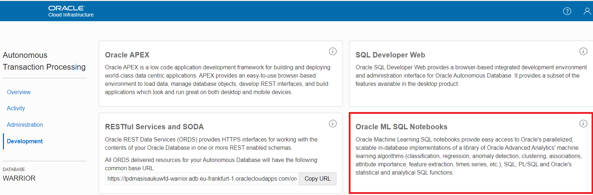

- Explore machine learning console. As you can see, there is quick start guide for each operation in the console. Let's open **Notebooks**. We will create a new machine learning notebook in this step.

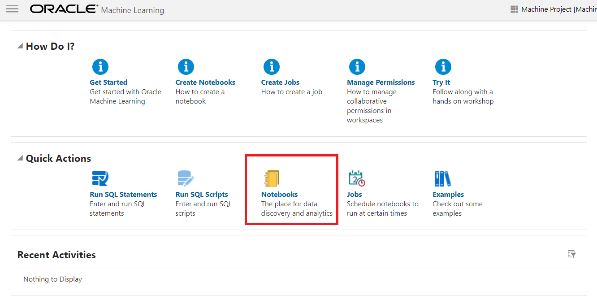

- Click on the **Create** button in the upper left corner, then provide a name to your notebook. This will create our machine learning model, to find the customers who is likely to buy Y-box-games.

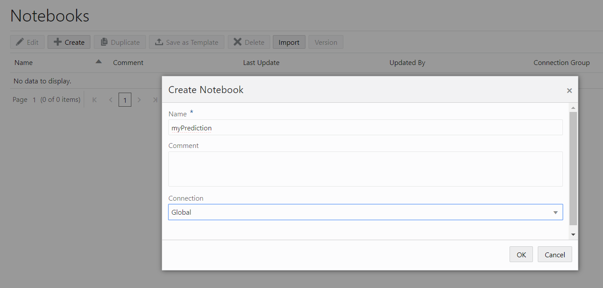  

## Create Machine Learning model using built-in Zeppelin server.
Now enter below query and click play button as shown in image. This lets you to run your PL/SQL script in the notebook.
```
SELECT * FROM SH.SUPPLEMENTARY_DEMOGRAPHICS
```
Scroll columns in the result to "Y_BOX_GAMES", which tells us whether the customer already owns Y Box Games. Also we can see many other attributes of which we believe they may have some influence on whether a customer owns Y Box Games. For example, the level of education might be an influencing factor for Y Box Games ownership, and so may Occupation, Household Size, etc.
The magic of machine learning is that it will find out exactly what the relationships are between these variables and our target variable, Y Box Games.

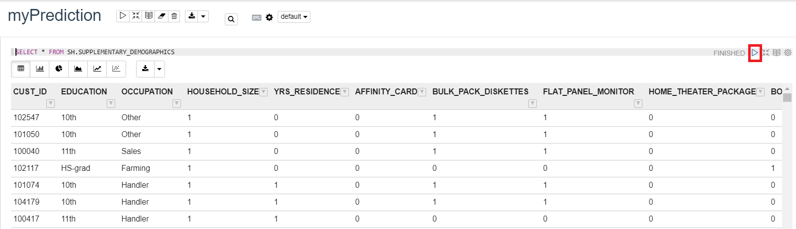  

- Split the input data into two sets: 60% for train data
```
%script
BEGIN
EXECUTE IMMEDIATE 'DROP Table N1_TRAIN_DATA';
EXCEPTION
WHEN OTHERS THEN NULL;
END;
/
CREATE TABLE N1_TRAIN_DATA AS SELECT * FROM SH.SUPPLEMENTARY_DEMOGRAPHICS SAMPLE (60) SEED (1);

```
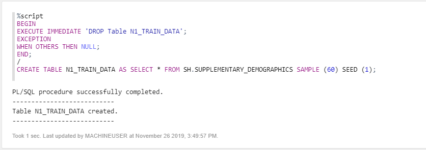  
- Split the input data into two sets: 40% for testing the data
```
%script
BEGIN
EXECUTE IMMEDIATE 'DROP Table N1_TEST_DATA';
EXCEPTION
WHEN OTHERS THEN NULL;
END;
/
CREATE TABLE N1_TEST_DATA AS SELECT * FROM SH.SUPPLEMENTARY_DEMOGRAPHICS MINUS SELECT * FROM N1_TRAIN_DATA;
```
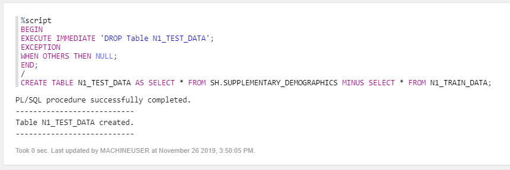  
- The model will contain the defintion of the relationship between the driving attributes and the target attribute (Y Box Games). Creating those relationships is done during the training phase. Defining a model requires several parameters. We first store those parameters in a table. This table can have any name. In our case the only parameter is the type of algorithm, in this case a decision tree model.
Enter the following SQL to create the parameters table with machine learning algorithm decision tree.
```
%script
BEGIN
EXECUTE IMMEDIATE 'DROP Table N1_BUILD_SETTINGS';
EXCEPTION
WHEN OTHERS THEN NULL;
END;
/
CREATE TABLE N1_BUILD_SETTINGS (SETTING_NAME VARCHAR2(30), SETTING_VALUE VARCHAR2(4000));
INSERT INTO N1_BUILD_SETTINGS (SETTING_NAME, SETTING_VALUE) VALUES ('ALGO_NAME','ALGO_DECISION_TREE');
```
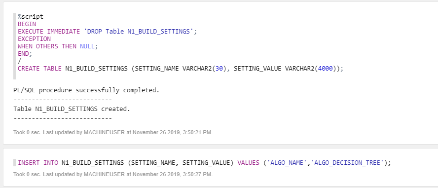  

- Now we are ready to create and train the model. Run the following PL/SQL to do this.
```
%script
CALL DBMS_DATA_MINING.DROP_MODEL('N1_CLASS_MODEL');
CALL DBMS_DATA_MINING.CREATE_MODEL('N1_CLASS_MODEL', 'CLASSIFICATION', 'N1_TRAIN_DATA', 'CUST_ID','Y_BOX_GAMES', 'N1_BUILD_SETTINGS');
```
The parameters mean the following:
1. The name that our model will have. This is stored in the database as a special type of object.
2. Whether it's a classification or a regression algorithm. In this case it's a classification algorithm, because we're predicting a class (ownership yes/no) rather than a continuous value.
3. The name of the table to use for training. We created this earlier when we split the dataset.
4. The name of the column that uniquely identifies each row in the training data. In this case the customer ID.
5. The name of the target column that we want to find the driving factors for, Y Box Games.
6. Lastly, the name of the hyperparameters table. In this case it only contains a parameter with the type of model (decision tree).

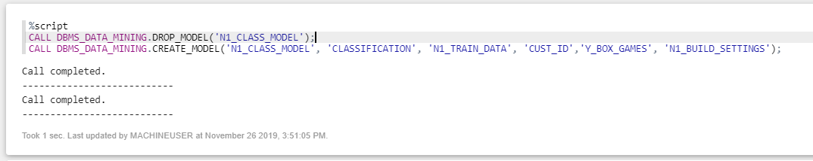  

- We would like to know in what percentage of the cases, the model makes a correct prediction of Y Box Games ownership. This is where the test set, that we created earlier, comes in handy. Since the test set contains real customers, we know whether they actually own Y Box Games. We will verify the performance by letting our model predict Y Box Games for those same records. This will allow us to verify if the predicted value of Y Box Games is the same as the actual value.
So, create a new placeholder column in the test set that will hold the predicted value and then make the prediction.
```
%script
ALTER TABLE N1_TEST_DATA ADD Y_BOX_GAMES_PRED NUMBER(1);
UPDATE N1_TEST_DATA SET Y_BOX_GAMES_PRED = PREDICTION(N1_CLASS_MODEL USING *);
```
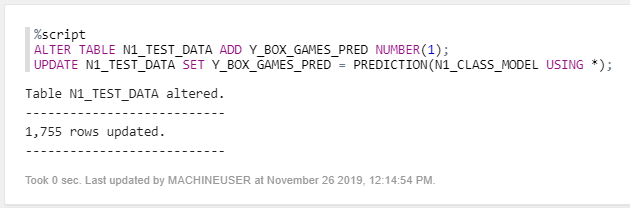  
You see that this uses special SQL syntax. The above means that we want to predict the value using model N1_CLASS_MODEL and all of the driving columns in the dataset will be used.

- Let's see the result
```
SELECT CUST_ID, Y_BOX_GAMES, Y_BOX_GAMES_PRED FROM N1_TEST_DATA
```

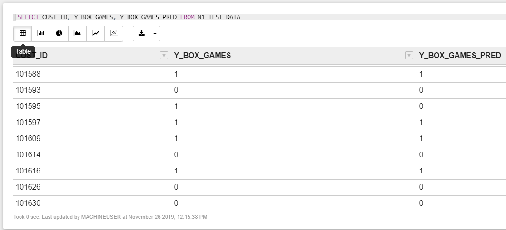  

- Let's see in what percentage of cases our prediction is correct
```
SELECT TO_CHAR(((SELECT COUNT(*) FROM N1_TEST_DATA WHERE Y_BOX_GAMES = Y_BOX_GAMES_PRED) / (SELECT COUNT(*) FROM N1_TEST_DATA)) * 100, '999.99') CORRECT_PRED_PERCENTAGE FROM DUAL;
```
  
The result is an accuracy of almost 90%.
- We can look into this number in more detail with a confusion matrix. This can easily be created by grouping on the two Y Box Games columns.
```
SELECT Y_BOX_GAMES, Y_BOX_GAMES_PRED, COUNT(*) FROM N1_TEST_DATA GROUP BY Y_BOX_GAMES, Y_BOX_GAMES_PRED ORDER BY 1, 2;
```
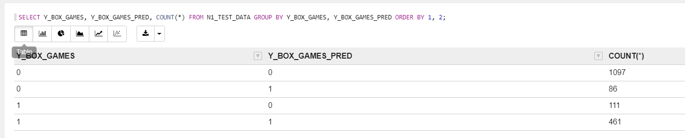  
We see, from top to bottom: 1. The true negatives, 2. The false positives, 3. The false negatives and 4. The true positives.

## Run the prediction
- So far we've built and validated the model, we will all the customers who don't have Y Box Games yet, then predict whether they are likely to be interested in a purchase. In order to do so, let's run below code to create a new table **CUST_PREDICTION** using our prediction model

```
CREATE TABLE CUST_PREDICTION AS
SELECT CUST_ID, PREDICTION(N1_CLASS_MODEL USING *) PREDICTION, PREDICTION_PROBABILITY(N1_CLASS_MODEL USING *) PRED_PROBABILITY
FROM SH.SUPPLEMENTARY_DEMOGRAPHICS WHERE Y_BOX_GAMES = 0;
```
- Then we will grant a right to use this table to **WORKSHOPATP** schema 
```
grant select on cust_prediction to workshopatp
```
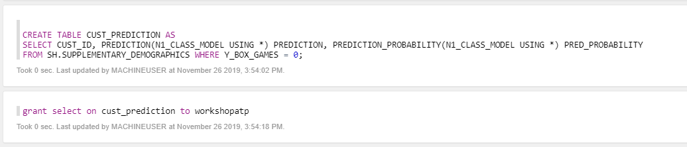  
*Note that we could go a step further and schedule this prediction, but this is not part of the workshop today

## Integrate the result into the APEX application
- Now let's tie it all together and go back to the APEX application. Remember, we want to show a recommendation to our employee when the customer he's speaking to it a likely candidate to buy Y Box Games.

- Open APEX. You can do this from Service Console of the database, then Admin, then APEX. Login to the workspace that we created earlier. Workspace name: WORKSHOPATP, User name: WORKSHOPATP, use the password that you entered when you created the workspace.
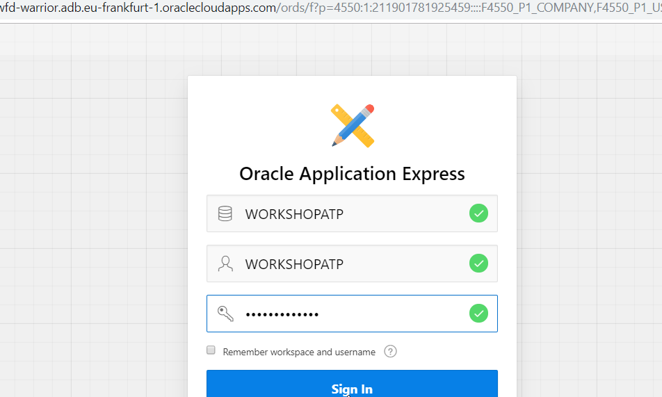

- We are going to edit the definition of customer page to add a column that contains our recommendation. Go to your Autonomous datbaase console, open the SQL Developer.
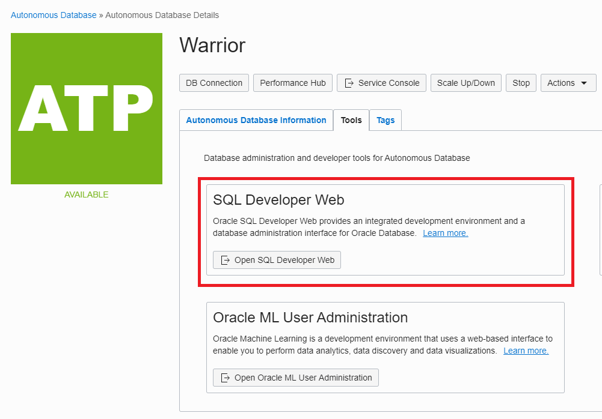 

- We will create a view by adding a "RECOMMENDATION" column to it. Here is the script and run it in **SQL Developer**.
```
CREATE OR REPLACE FORCE EDITIONABLE VIEW  WORKSHOPATP.CUSTOMER_V (
  "CUST_ID","CUST_FIRST_NAME","CUST_LAST_NAME","CUST_GENDER","CUST_YEAR_OF_BIRTH","CUST_MARITAL_STATUS","CUST_STREET_ADDRESS","CUST_POSTAL_CODE",
  "CUST_CITY","CUST_COUNTRY","CUST_MAIN_PHONE_NUMBER","CUST_INCOME_LEVEL","CUST_CREDIT_LIMIT","CUST_EMAIL",
  "RECOMMENDATION") DEFAULT COLLATION "USING_NLS_COMP" AS
SELECT
  "CUST_ID","CUST_FIRST_NAME","CUST_LAST_NAME","CUST_GENDER","CUST_YEAR_OF_BIRTH","CUST_MARITAL_STATUS","CUST_STREET_ADDRESS","CUST_POSTAL_CODE",
  "CUST_CITY","CUST_COUNTRY","CUST_MAIN_PHONE_NUMBER","CUST_INCOME_LEVEL","CUST_CREDIT_LIMIT","CUST_EMAIL",
  (select c.cust_first_name || ' is ' || to_char(p.pred_probability * 100, '999.99') || '% likely to be interested in Y Box Games' 
  from machineuser.cust_prediction p 
  where p.cust_id = c.cust_id 
  and p.prediction = 1 )	
  from workshopatp.customers c;
```
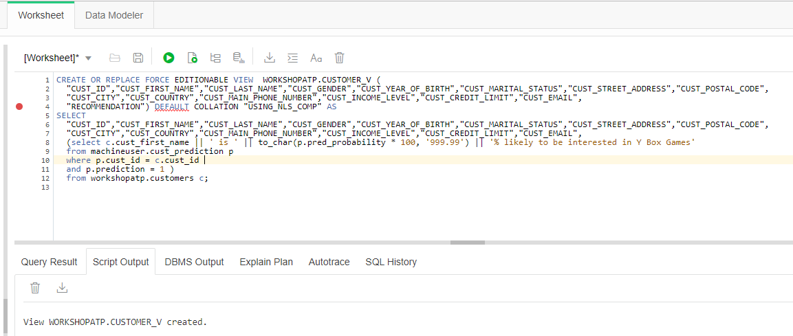  
Note how this SQL will add a column "Recommendation", and it will be a text that explains whether the employee should try to upsell Y Box Games to this customer. In addition, the recommendation will only be added when the probability of an upsell is high enough.

- Go back to the APEX application and edit the Customers page. Replace the previous select statement with below query then save the page

```
SELECT
    CUST_ID,
    CUST_FIRST_NAME,
    CUST_LAST_NAME,
    CUST_GENDER,
    CUST_YEAR_OF_BIRTH,
    CUST_MARITAL_STATUS,
    CUST_STREET_ADDRESS,
    CUST_POSTAL_CODE,
    CUST_CITY,
    CUST_COUNTRY,
    CUST_MAIN_PHONE_NUMBER,
    CUST_INCOME_LEVEL,
    CUST_CREDIT_LIMIT,
    CUST_EMAIL,
    RECOMMENDATION
FROM
    WORKSHOPATP.CUSTOMER_V;
```

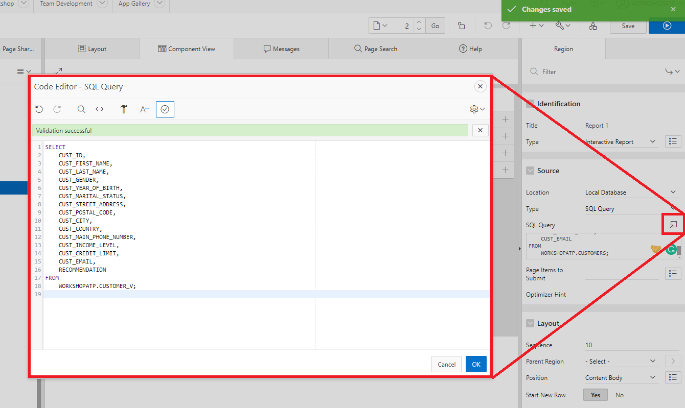  

## Run the APEX application

- In the main screen you see that for most customers it's not recommended to try to upsell Y Box Games. It's unlikely that these customers will be interested. 
- Now look for a customer with first name "Connor" and last name "Clark". Note that in this case we see a recommendation to try to upsell Y Box Games, because the customer is very likely to be interested in this offer.

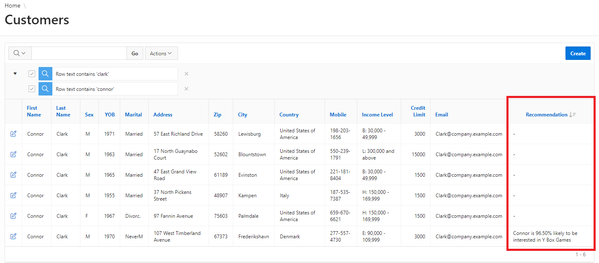 

One added column in an application might not look like much, but the value to the business can be significant. In
this case an employee receives very valuable advise on which customer to try to upsell a product to and he/she
can use that to be more effective.
You have learned how to predict values (a classifier in this case) based on sample training data.
Specifically, you have learned how to predict which customer may be interested in a certain product.
You have learned how to operate the Zeppelin notebooks.
You have learned how to integrate the prediction in an APEX application.
  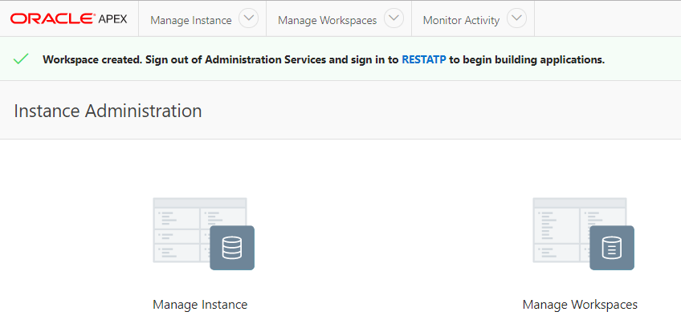
  
## This concludes the generic idea of Machine learning in Autonomous Database.

## You may continue to next step 
- [Next step is not ready](README.md)
- However you maybe find [this file](/files/ATP-Hands-on-Lab.pdf) as outdated, but I'd suggest you to try at least Node.js and Python parts.

## Follow-up questions


[bilegt.bat.ochir@oracle.com](mailto:bilegt.bat.ochir@oracle.com)
